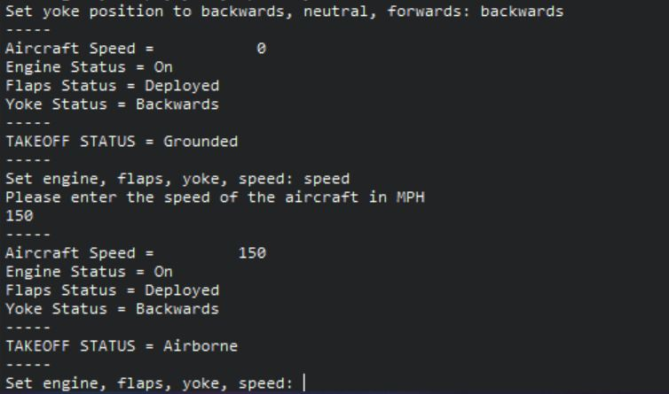

# Simple-takeoff-system

A simple aircraft take-off system written in SPARK Ada.

Created for a university coursework. 

## Usage
```
# choose option:
engine
yoke
speed
flaps

# flaps --------------
# [deploy flaps]
deployed
# [retract flaps]
retracted

# engine -------------
# [engine on]
on
# [engine off]
off

# yoke ---------------
# [yoke pulled backwards]
backwards
# [yoke in neutral]
#neutral
#[yoke pushed forwards]
forwards

# speed --------------
# [integer between 1 and 177]
```
## An Example run of the program
Displaying takeoff status changing from grounded to airbourne


